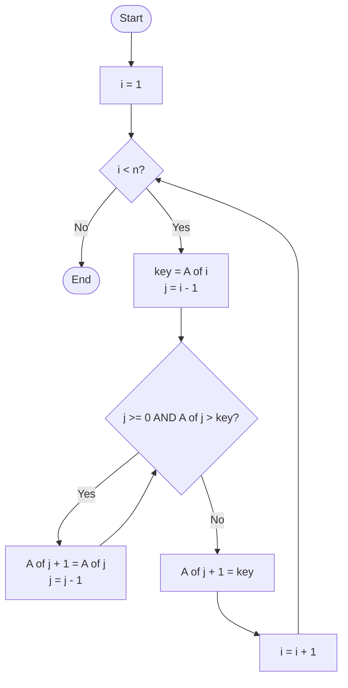

# Insertion Sort

```mermaid
flowchart TD
    Start([Start]) --> Outer[i = 1]
    Outer --> OuterCheck{i < n?}
    OuterCheck -- No --> End([End])
    OuterCheck -- Yes --> Key[key = A of i<br/>j = i - 1]
    Key --> InnerCheck{j >= 0 AND A of j > key?}
    InnerCheck -- Yes --> Shift[A of j + 1 = A of j<br/>j = j - 1]
    Shift --> InnerCheck
    InnerCheck -- No --> Place[A of j + 1 = key]
    Place --> Increment[i = i + 1]
    Increment --> OuterCheck
```

**Complexity:** O(n²) time, O(1) space. Stable sort. Efficient for small or nearly-sorted slices.
