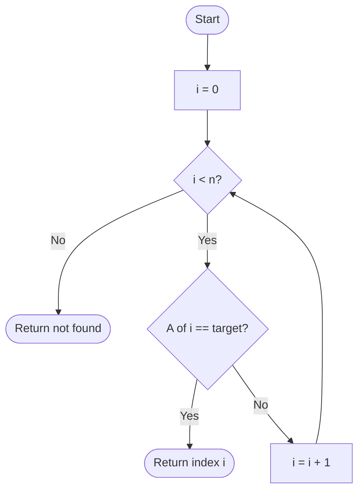

# Linear Search

```mermaid
flowchart TD
    Start([Start]) --> Init[i = 0]
    Init --> Check{i < n?}
    Check -- No --> NotFound([Return not found])
    Check -- Yes --> Compare{A of i == target?}
    Compare -- Yes --> Found([Return index i])
    Compare -- No --> Next[i = i + 1]
    Next --> Check
```

**Complexity:** O(n) time, O(1) space. Works on unsorted data; no precondition on ordering.
